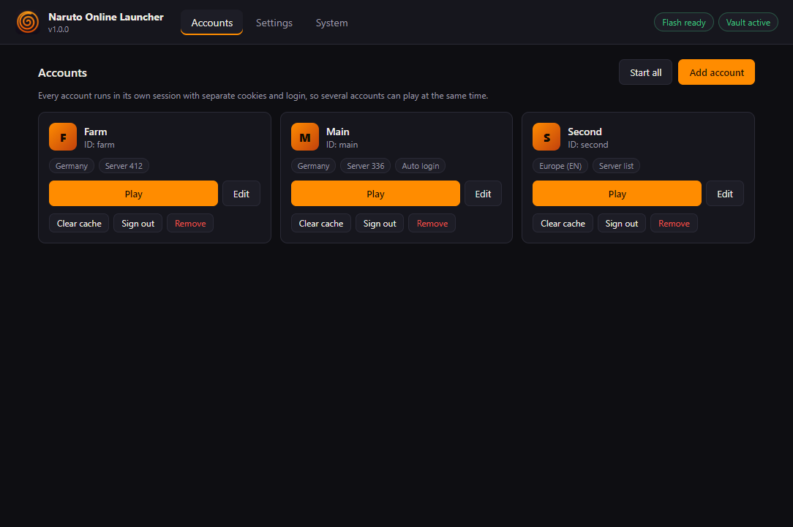

<p align="center"></p>

# Naruto Online Launcher

A desktop launcher for Naruto Online that runs on Windows and Linux. It uses Electron 11 with the PPAPI Flash plugin, so the game runs the same way it did in the browser, and adds a few things the browser never had: several accounts side by side in tabs, automatic sign-in from an encrypted vault, a tracker blocker and settings that actually change how Flash renders.

The interface is available in English and German.



## Features

- **Accounts in tabs.** Every account has its own session (cookies, cache, login). Start several at once in one window (or all of them with one click), or turn tabs off and get one window per account.
- **Automatic sign-in.** Username and password are stored encrypted. The launcher fills in the login form and clicks sign in once; a wrong password is never retried in a loop. A valid login is kept across restarts.
- **Zoom per account.** `Ctrl` + `+` / `-` / `0` in the game window, remembered for each account. *Sharp* (default) redraws the game at the larger size; *smooth* scales the finished picture with filtering. See [Performance](#performance).
- **Pages in tabs.** Top-up, the official website and support open as another tab in the game window instead of a small extra window, so the game stays where it is.
- **Windows stay where you put them.** Position and size of the launcher and of the game window are remembered.
- **Sound.** Mute a tab with `Ctrl+M` (remembered per account), or let only the active tab play sound.
- **Flash quality.** Set from low to best on the Flash embed before the game starts. See [Performance](#performance).
- **Faster restarts.** Versioned game files are kept in the cache instead of being downloaded again.
- **Crash recovery.** If the Flash plugin crashes, the game reloads by itself (at most three times in ten minutes).
- **Privacy.** Google Analytics, Facebook Pixel, Cloudflare Insights and the OAS analytics endpoints are blocked. The login server and the game API are never touched.
- **Flash included.** The release builds ship the plugin, nothing to install separately.

Shortcuts in the game window: `F11` fullscreen, `F5` reload, `Ctrl+Tab` next tab, `Ctrl+M` mute, `F9` screenshot (saved to *Pictures/Naruto Online*).

## Download

Get the latest build from the [releases page](https://github.com/baba537/Naruto-Online-Launcher/releases/latest).

| System | File |
|---|---|
| Windows 10/11, installer | `Naruto-Online-Launcher-Setup-<version>.exe` |
| Windows 10/11, portable | `Naruto-Online-Launcher-Portable-<version>.exe` |
| Linux, any distribution | `Naruto-Online-Launcher-<version>-x86_64.AppImage` |
| Debian, Ubuntu, Mint | `Naruto-Online-Launcher-<version>-amd64.deb` |

The builds are not code signed. Windows SmartScreen shows a warning on the first start: *More info → Run anyway*.

On Linux, make the AppImage executable first:

```bash
chmod +x Naruto-Online-Launcher-*.AppImage
./Naruto-Online-Launcher-*.AppImage
```

Some distributions need `libfuse2` for AppImages. The `.deb` package does not.

### Updating

Run the new installer (or `.deb`) over the existing one, or replace the AppImage. Accounts, saved logins, settings and the cache are kept: they live next to the app, not inside it.

| System | Data folder |
|---|---|
| Windows | `%APPDATA%\Naruto Online Launcher` |
| Linux | `~/.config/Naruto Online Launcher` |

At startup the launcher asks GitHub once whether a newer release exists and shows a note if so. It never downloads or installs anything by itself; the check can be turned off in the settings.

## Performance

The game already hands its frames to the GPU (it embeds Flash with `wmode=direct`) and runs its logic in a single thread, so Chromium flags alone hardly change the frame rate. What makes a difference is the Flash quality, which decides how much drawing work each frame is:

| Preset | Flash quality | Notes |
|---|---|---|
| Quality | best | Smoothed bitmaps and edges, looks best when zoomed in |
| Balanced | game default (high) | Higher process priority |
| Performance | medium | No VSync, high priority |
| Low-spec | low | No anti-aliasing, smaller caches; clearly faster on weak PCs |

*Automatic* picks Quality on machines with 8 GB RAM and 4 threads or more, Low-spec below 4 GB RAM or two threads, and Balanced in between. The Flash quality can also be set on its own in the settings. The game can change the quality through its own settings menu; whatever it sets last wins.

In the background the launcher also:

- raises the priority of the Flash process
- pins it to the performance cores on hybrid Intel CPUs (Linux)
- sets driver variables for NVIDIA, AMD and Intel on Linux
- writes a per-session `mms.cfg` for Flash

Zoom modes:

- **Smooth**: Flash draws at its normal size and the GPU scales the finished picture up with filtering. No lines, but softer.
- **Sharp** (default): the game is drawn again at the larger size. The zoom moves in 20 % steps, because the game map shows thin lines at the steps in between.

Memory: the Flash plugin takes what it needs, there is no limit to raise. The launcher warns when a single Flash process goes above 3 GB (1.8 GB on Low-spec); a reload with `F5` frees it.

## What the launcher does, and what it does not

- It opens the official game website (`naruto.narutowebgame.com`) in its own window. The game itself runs unchanged in Adobe's Flash plugin.
- The site shows a reduced launcher layout when it is asked for it with the URL parameters `leftbar_collapse=Yes&launcher=…` and a matching user agent. The launcher sends the same values the site already knows from existing launchers; nothing else about the requests is changed. On Linux, pages the game opens (website, top-up) also report the platform Windows, matching that user agent; otherwise the website switches to its mobile layout.
- Sign-in fills the site's own login form and clicks its button. There is no private API use and no modification of game traffic.
- Requests to analytics and tracking hosts are cancelled. Everything else goes straight to the game's servers; the launcher has no server of its own and sends nothing anywhere else.
- The only request that does not go to the game: the version check at `api.github.com` (switchable). It sends nothing but the request itself.
- Stored on your computer: settings, the encrypted vault, logs, and the browser data (cookies, cache) of each account.
- The Flash plugin files are Adobe's (version 34.0.0.376 for Windows, 34.0.0.137 for Linux). Their SHA-256 values are in [resources/flash](resources/flash) and are checked at startup.

## Security

**Launcher window**
- Sandboxed renderer with `contextIsolation` and no Node.js.
- Strict Content Security Policy.
- No network access at all.
- A fixed set of IPC calls that check the sender and validate every argument.

**Game views**
- Sandboxed renderer with `contextIsolation`, no Node.js, no bridge into the page. Flash itself runs in a separate plugin process.
- Navigation is limited to `narutowebgame.com` and `oasgames.com`, plus the Google, Facebook and Apple sign-in pages. Other links open in your browser.
- Camera, microphone, location and notifications are denied.
- Downloads are blocked.
- Sign-in runs in an isolated script world, and only on the game's own domains.
- Game pages are always loaded over https, and WebRTC cannot reveal local network addresses.
- The bundled Flash plugin is checked against its known SHA-256 before it is loaded.

**Vault**
- Each login is encrypted with AES-256-GCM, bound to its account.
- The key is protected by Windows DPAPI or the Linux keyring (`secret-tool`). Optionally it is protected by a master password (PBKDF2-SHA256, 600,000 rounds).
- Without a keyring on Linux, a machine-bound key is used; set a master password in that case.
- Passwords never reach the launcher window.

**Release builds** refuse remote debugging switches.

The strict network mode (on by default) only lets the game views talk to known game hosts.

**Pages the game opens itself** (top-up, website, support) run as browsing views: the tracker blocker stays on and they are sandboxed like the game views, but the strict allowlist is not applied and they may follow https links. A checkout runs over payment providers that cannot be listed in advance. Sign-in with a bank or a payment provider happens on their own pages; the launcher never sees or stores those details, and downloads stay blocked.

## Building from source

Requirements: Node.js 16 or 18, npm, Git.

```bash
git clone https://github.com/baba537/Naruto-Online-Launcher.git
cd Naruto-Online-Launcher
npm install
npm start
```

| Command | What it does |
|---|---|
| `npm start` | Runs the launcher in development mode (`F12` opens DevTools) |
| `npm run check` | Syntax check and tests that run without Electron |
| `npm run build:win` | Windows installer and portable EXE in `dist/` |
| `npm run build:linux` | AppImage and `.deb` in `dist/` (build on Linux) |

Electron stays on 11.5.0. PPAPI support was removed in Electron 12, and no maintained browser engine can load Flash any more. The launcher limits what the old engine is exposed to instead: game views are sandboxed, may only open the game's own domains and, in strict mode, only load from known game hosts.

A push to `main` builds both platforms. If `package.json` carries a version without a release, the workflow creates release `v<version>` with all four files. Pushing a tag `v*` attaches the files to that tag's release.

```
src/
  main.js              startup, Chromium switches, IPC
  preload.js           API for the launcher window
  gamePreload.js       adjusts the Flash embed in game views
  tabsPreload.js       API for the tab strip
  config/              regions and domains, performance presets
  modules/
    sessionManager.js  game sessions, sign-in, crash recovery
    gameHost.js        game window with tabs
    autoLogin.js       login cookie and sign-in script
    credentialVault.js encrypted accounts
    security.js        tracker blocker, navigation, permissions
    assetCache.js      cache headers for versioned game files
    gpuDetector.js     GPU detection, Linux driver variables
    cpuOptimizer.js    priority and core affinity
    flashManager.js    plugin lookup, version, mms.cfg
  renderer/            launcher UI and tab strip
  shared/i18n.js       English and German texts
resources/flash/       PPAPI Flash for Windows and Linux
```

## Troubleshooting

| Problem | Try this |
|---|---|
| Automatic sign-in fails | Check the saved login (Edit). The game site sometimes shows a captcha; then sign in by hand once. |
| White or black area instead of the game | Set the Flash quality to *Game default* and start the game again. |
| Clicks land in the wrong place with smooth zoom | Switch the zoom back to *Sharp* in the settings. |
| Something in the game does not load (shop, events) | Turn off the strict network mode and send the log; it lists the blocked host. |
| "Sorry, you have been blocked" | Cloudflare blocks your connection for a while. Wait, or restart your router for a new IP. |
| AppImage does not start (Ubuntu 23.10 and later) | The launcher turns off the Chromium sandbox automatically when user namespaces are blocked. If it still fails, start it with `--no-sandbox` or use the `.deb`. |
| Login not saved on Linux | Install `libsecret-tools` or set a master password. |

The log file is under *System → Show log file*. It never contains passwords. *Detailed log* in the settings adds more information.

## Legal

This is an unofficial fan project and not affiliated with Oasis Games, Tencent, Studio Pierrot, Shueisha or Masashi Kishimoto. "Naruto" and "Naruto Online" are trademarks of their owners. The launcher shows the official game website in its own window and does not modify the game or its traffic, apart from blocking trackers.

Adobe Flash Player is a trademark of Adobe. The bundled plugin files are Adobe's and are not covered by this project's license.

The launcher code is released under the [MIT license](LICENSE).

Parts of this project were created with AI assistance.
